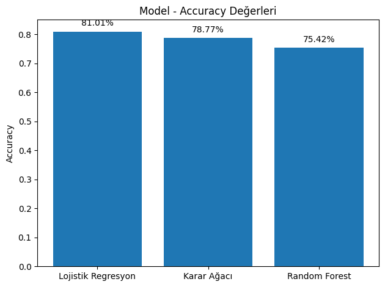
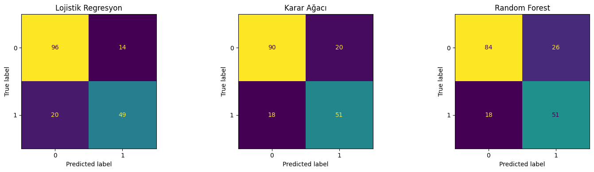
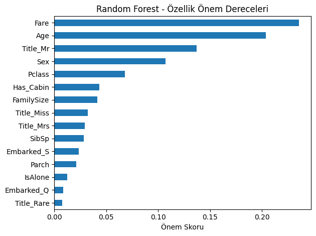

# Titanic Survival Prediction
Titanic yolcu verisi kullanılarak geliştirilen bir makine öğrenmesi sınıflandırma projesidir.

Bu proje, **HSD ve Türkiye Yapay Zeka Akademisi — Veri Bilimi ve Makine Öğrenmesi Bootcamp** final ödevi kapsamında hazırlanmıştır.

## Projenin Amacı

Bir yolcunun yaşı, cinsiyeti, bilet sınıfı, aile büyüklüğü ve benzeri özelliklerinden yararlanarak, yolcunun Titanic kazasından sağ kurtulup kurtulmadığını tahmin etmek.

## Kullanılan Veri Seti

Projede Kaggle'ın Titanic veri seti kullanılmıştır.

[ Titanic Dataset — Kaggle](https://www.kaggle.com/competitions/titanic/data)

## Veri Ön İşleme

Projede aşağıdaki veri hazırlama işlemleri uygulanmıştır:

* Eksik `Cabin` değerleri için `Has_Cabin` özelliği oluşturuldu.
* Eksik `Age` değerleri `Sex` gruplarına göre medyan ile dolduruldu.
* Eksik `Embarked` değerleri mod ile dolduruldu.
* `Name` sütunundan `Title` özelliği çıkarıldı.
* Nadir görülen `Title` değerleri `Rare` kategorisinde birleştirildi.
* `FamilySize` özelliği oluşturuldu.
* `IsAlone` özelliği oluşturuldu.
* Kategorik değişkenlere encoding uygulandı.
* `PassengerId` ve `Ticket` sütunları veri setinden çıkarıldı.

## Kullanılan Modeller

Projede üç farklı sınıflandırma algoritması karşılaştırılmıştır:

* Logistic Regression
* Decision Tree
* Random Forest

## Model Sonuçları

| Model               |   Accuracy |
| ------------------- | ---------: |
| Logistic Regression | **81.00%** |
| Decision Tree       | **78.77%** |
| Random Forest       | **75.42%** |

Bu sonuçlara göre en yüksek accuracy değerini **Logistic Regression** modeli vermiştir.

## Görselleştirmeler

### Model Performansları

### Sınıflandırma Sonuçları

### Özelliklerin Katkısı

## Kullanılan Teknolojiler

* Python
* Pandas
* Scikit-learn
* Matplotlib
* Seaborn

## Proje Yazısı

Projenin detaylı anlatımına Medium yazım üzerinden ulaşabilirsiniz.

[Medium yazısı — Titanic Verisiyle Makine Öğrenmesi Projem: Kim Hayatta Kalır?](https://medium.com/@aylinmercaan/titanic-verisiyle-makine-%C3%B6%C4%9Frenmesi-projem-kim-hayatta-kal%C4%B1r-9ef8bcbb4725?sharedUserId=aylinmercaan)

## Geliştirme Fikirleri

Bu projenin sonraki aşamalarında:

* Cross-validation uygulanması,
* Hyperparameter tuning yapılması,
* Preprocessing işlemlerinin Pipeline yapısına taşınması,
* Farklı sınıflandırma algoritmalarının denenmesi

planlanabilir.

